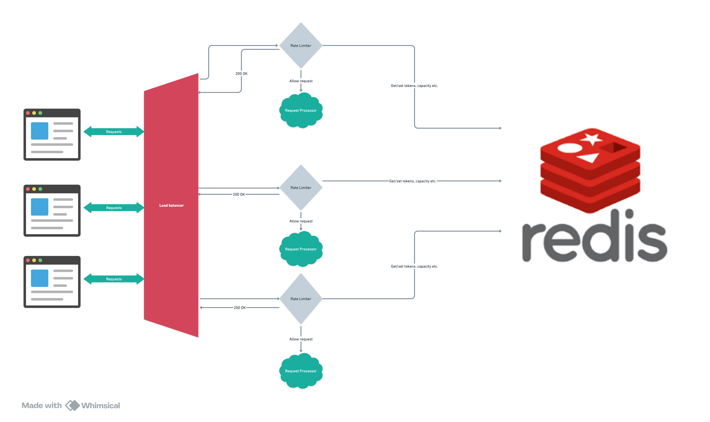

= Designing and Implementing an API Rate Limiter

== Introduction to API Rate Limiting

APIs serve as the backbone of modern software systems, enabling communication between different applications. However, without proper control, APIs can be overwhelmed by excessive requests, potentially leading to degraded performance or even downtime. This is where API rate limiting comes into play.

API rate limiting is a mechanism that restricts the number of requests a client can make to an API within a specified time period.
By doing so, it ensures fair usage among clients, protects system resources, and maintains service stability.
In this article, we will explore the architecture, design,
and implementation of an API rate limiter using the Spring framework and Redis.
The full implementation code is available on link:https://github.com/ahmedjaadi/api-rate-limiter[GitHub].

== Why Should You Rate Limit Your API?

APIs are integral to many businesses, and their reliability is critical. Implementing a rate limiter provides several benefits:

. **Enhancing Security**: Rate limiting prevents denial-of-service (DoS) attacks by limiting the number of requests a malicious user can make.
. **Mitigating Noisy Neighbors**: In multi-tenant systems, one client's excessive use should not degrade the performance experienced by others.
. **Preventing Resource Starvation**: Rate limiting ensures that API consumers cannot monopolize resources, safeguarding the infrastructure from being overwhelmed.

== Understanding the Architecture of an API Rate Limiter

A robust API rate limiter consists of several key components working together to manage and enforce rate limits. Let’s delve into the architecture:

=== Load Balancer
A load balancer is a standard component in distributed systems. It evenly distributes incoming network traffic across multiple service instances to ensure reliability and scalability. In the context of rate limiting, it ensures that no single instance of the rate limiter or the protected API server is overwhelmed.

=== Rate Limiter
The rate limiter is the core component. It intercepts requests before they reach the protected API server (often called the Request Processor). Based on predefined rules, the rate limiter decides whether to allow or throttle requests. Throttling may involve rejecting requests or queuing them for later processing.

=== Request Processor
This is the actual API server that processes valid requests. In our prototype, the rate limiter and the request processor are combined for simplicity. However, in real-world scenarios, these are often separate applications.

=== Redis as a Distributed Cache
Redis is used to store and sync rate limit states across distributed instances of the rate limiter. It ensures that all instances share a consistent view of the rate limits, making the system scalable and fault-tolerant.

=== Rules Engine Service and Database
The rules engine service defines the rate-limiting policies, such as the maximum number of requests allowed per time window and the actions to take when limits are exceeded. For brevity, our prototype uses hardcoded rules, but in a production-grade system, these rules would be dynamically retrieved from a database.

=== Queue
A queue can serve multiple purposes, such as:

- Temporarily holding requests during high traffic periods for later processing.
- Implementing soft throttling by delaying requests instead of outright rejecting them.

== What is Scaling and How Is It Implemented?

Scaling refers to the ability of a system to handle increasing amounts of workload by adding resources. In the context of an API rate limiter, scaling ensures that the system can manage growing traffic without performance degradation. There are two types of scaling:

. **Vertical Scaling**: Adding more resources (e.g., CPU, memory) to a single instance. While straightforward, it has physical limits and can become costly.
. **Horizontal Scaling**: Adding more instances of a service to distribute the workload. This is the preferred approach for modern distributed systems as it offers better resilience and flexibility.

In our implementation, horizontal scaling is achieved by:

- Deploying multiple instances of the rate limiter, each paired with a request processor.
- Using Redis as a distributed cache to synchronize rate limit states across all instances.

== What is Throttling?

Throttling is the process of regulating the rate of incoming requests to an API. When a client exceeds its allowed quota, throttling mechanisms decide how to handle the excess requests. There are two main strategies:

=== Hard Throttling
Hard throttling enforces strict limits. Once a client reaches its quota, any additional requests are immediately rejected. This approach is straightforward and is typically applied to general or untrusted clients.

=== Soft Throttling
Soft throttling provides a more lenient approach, especially for premium or trusted clients. Instead of outright rejecting requests, soft throttling may:

- Allow a certain percentage of excess requests to pass through.
- Queue excess requests for processing once traffic subsides.

The choice between hard and soft throttling depends on business requirements. For instance, a subscription-based service might implement soft throttling for premium users to enhance their experience, while applying hard throttling for standard users.

== Designing the Application

Our application design includes the following key concepts:

=== Domain Modeling
- **RateLimit**: Defines the properties of a rate limit, such as capacity and time period.
- **TenantRateLimit**: Represents the rate limits applicable to a specific tenant. It includes properties for monthly and time-window limits.
- **Bucket**: Tracks the live state of rate limits for each tenant. There is also a system-wide bucket for global limits.

image::application_design.png[400,400,title="Application Design", align="center"]

=== Service Interactions
- **TenantBucketProvider**: Manages the limit states for tenants. It has two implementations:
- `StandaloneBucketProvider`: Uses in-memory storage, suitable for standalone applications but not scalable.
- `RedisBucketProvider`: Uses Redis for distributed environments, enabling horizontal scalability.
- **ApiServerSender**: Forwards valid requests to the protected API server.

=== Endpoints
The application includes a `RateLimitController`, which processes requests matching `/api/v1/**`. It checks the tenant's bucket state using the `TenantBucketProvider`. If the request is within limits, it is forwarded; otherwise, it is throttled.

=== Profiles
The application supports two runtime profiles:

- `standalone`: Uses the `StandaloneBucketProvider`.
- `distributed`: Uses the `RedisBucketProvider`.

== Client Responsibilities

To ensure the effectiveness of the rate limiter, clients should adopt best practices:

- **Exponential Backoff**: Retry requests after progressively longer delays when encountering failures. This reduces server load and avoids immediate retries.
- **Jitter**: Add random delays (Jitter) to retry intervals to prevent simultaneous retries from multiple clients, which can overwhelm the server.

== Conclusion

API rate limiting is essential for maintaining the stability, security, and fairness of APIs. By understanding its architecture, scaling mechanisms, and implementation strategies, developers can design robust systems that handle diverse usage patterns effectively. For a hands-on demonstration, check out the implementation code on https://github.com/ahmedjaadi/api-rate-limiter[GitHub].